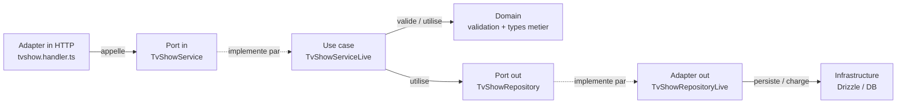
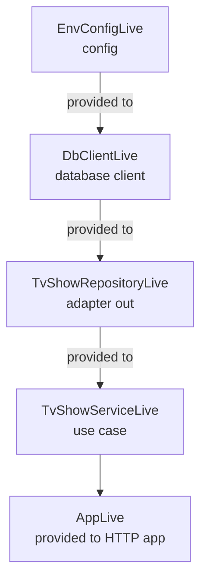

# Couche Application

Cette couche porte les cas d'utilisation de l'API. Elle ne connait pas HTTP, Drizzle, ni la base de donnees.

Le projet reste hexagonal, mais en FP avec Effect on ne parle pas d'interfaces OOP implementees par des classes. Les ports sont des `Context.Tag` Effect, et les implementations concretes sont branchees au runtime avec des `Layer`.

## Equivalent ports hexagonaux

| Hexagonal   | Definition et besoin                                                                                                                                                                                                                                                  | Fichier et mecanisme                                              | OOP                                                           |
| ----------- | --------------------------------------------------------------------------------------------------------------------------------------------------------------------------------------------------------------------------------------------------------------------- | ----------------------------------------------------------------- | ------------------------------------------------------------- |
| Port in     | Contrat d'entree de la couche application. Il definit ce qu'un adapter in peut demander au coeur applicatif, sans exposer comment le cas d'utilisation est execute.                                                                                                   | `tvshow.service.ts` avec `Context.Tag` Effect                     | Interface du ou des use cases                                 |
| Use case    | Implementation concrete d'un cas d'utilisation. Il orchestre les regles metier, appelle le domaine, puis utilise les ports out pour acceder aux dependances externes dont il a besoin.                                                                                | `tvshow.service.live.ts` avec `Layer.effect`                      | Classe de cas d'utilisation qui implemente le port in         |
| Port out    | Contrat de sortie de la couche application. Il represente un besoin externe du use case, par exemple sauvegarder un tv show, appeler une API externe, acceder au filesystem ou utiliser une lib externe (ex: Better Auth), sans connaitre l'implementation technique. | `tvshow.repository.ts` avec `Context.Tag` Effect                  | Interface de repository / gateway vers une dependance externe |
| Adapter out | Implementation externe d'un port out. Elle se trouve hors de la couche application et satisfait un besoin externe du use case. Elle implemente le contrat applicatif, puis le traduit vers une techno externe, ici Drizzle et la base de donnees.                     | `infrastructure/tvshow.repository.drizzle.ts` avec `Layer.effect` | Classe repository concrete qui implemente le port out         |
| Adapter in  | Point d'entree externe vers la couche application. Ici il traduit une requete HTTP en appel applicatif, puis traduit le resultat pour le client. Aujourd'hui l'entree est HTTP, mais elle pourrait aussi etre une CLI, un worker, un cron ou un consumer de messages. | `api/tvshow.handler.ts` qui demande `TvShowService`               | Controller / route handler                                    |

## Flow d'appel

Ce diagramme montre ce qui est appele quand une requete arrive.

## Wiring des Layers

Ce diagramme montre comment `main.ts` branche les implementations concretes au runtime.

