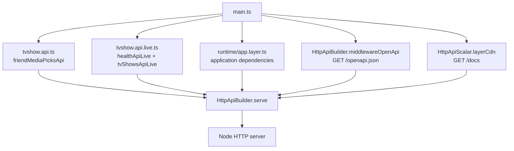
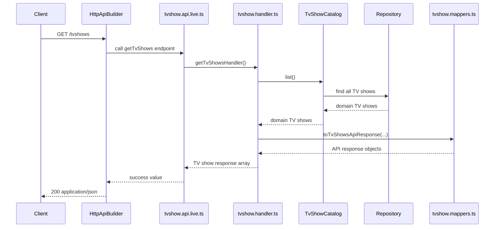
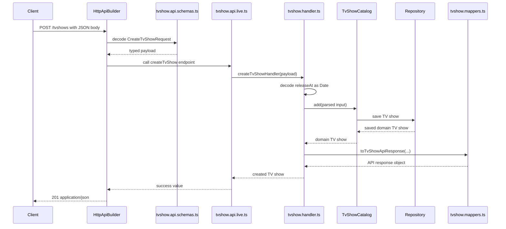
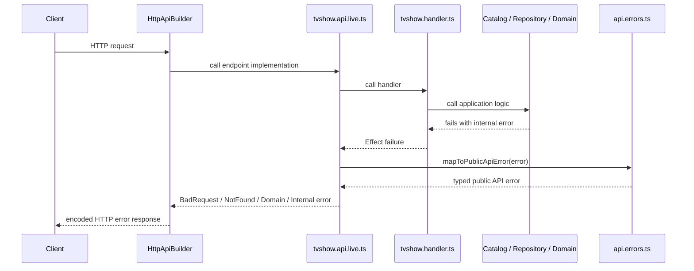
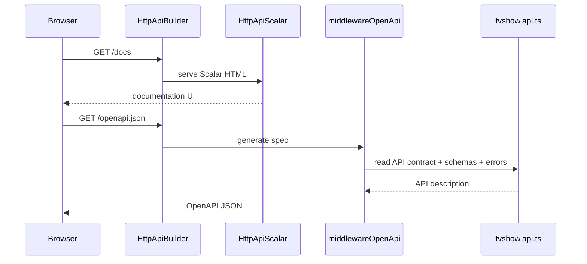

# TV Show API

This folder contains the HTTP/API boundary for the TV show feature.

The API contract is declared with Effect `HttpApi`. Runtime handlers are attached with `HttpApiBuilder`, and the same contract is used to expose OpenAPI and Scalar documentation.

## Files

| File                    | Role                                                                                                                        |
| ----------------------- | --------------------------------------------------------------------------------------------------------------------------- |
| `tvshow.api.ts`         | Public API contract: endpoint names, methods, paths, payload schemas, success responses, error responses, OpenAPI metadata. |
| `tvshow.api.schemas.ts` | Request, response, and path schemas used by the API contract and handlers.                                                  |
| `tvshow.api.live.ts`    | Runtime wiring between the API contract and handler functions.                                                              |
| `tvshow.handler.ts`     | HTTP-facing feature handlers. They prepare input and call the application service.                                          |
| `tvshow.mappers.ts`     | Maps domain entities to API response objects.                                                                               |
| `api.errors.ts`         | Maps internal failures to public typed HTTP API errors.                                                                     |

## Contract And Live

`tvshow.api.ts` is the HTTP interface for this feature. It describes what the API exposes, but it does not run the feature logic itself.

`tvshow.api.live.ts` is the runtime implementation of that interface. It tells Effect which handler function should run for each declared endpoint.

This follows the same idea as the rest of the codebase: define the contract first, then provide a live implementation.

## HttpApi Inputs

Effect `HttpApi` separates the different parts of an HTTP request:

| Input       | Meaning                        | Example                               |
| ----------- | ------------------------------ | ------------------------------------- |
| `payload`   | Request body                   | `POST /tvshows` with a JSON body      |
| `path`      | Path parameters from the route | `/tvshows/:id` gives `{ id }`         |
| `urlParams` | Query string parameters        | `/tvshows?page=1`                     |
| `headers`   | HTTP headers                   | `authorization`, `content-type`, etc. |

In this API:

- `CreateTvShowRequest` is used as the `payload` schema for `POST /tvshows`.
- `TvShowIdPathParams` is used as the `path` schema for `GET /tvshows/:id`.

## Startup Wiring

`main.ts` builds the server by combining the API contract, endpoint implementations, OpenAPI, Scalar, and application dependencies.

## Successful Read Request

Example: `GET /tvshows`.

## Successful Create Request

Example: `POST /tvshows`.

## Error Request

Errors stay as typed Effect failures until `HttpApiBuilder` encodes them as HTTP responses.

Public API errors are declared in `tvshow.api.ts` with `.addError(...)`, so `HttpApiBuilder` knows their status code and response shape.

## Documentation Request

`/docs` serves Scalar. Scalar reads the generated OpenAPI document from `/openapi.json`.

